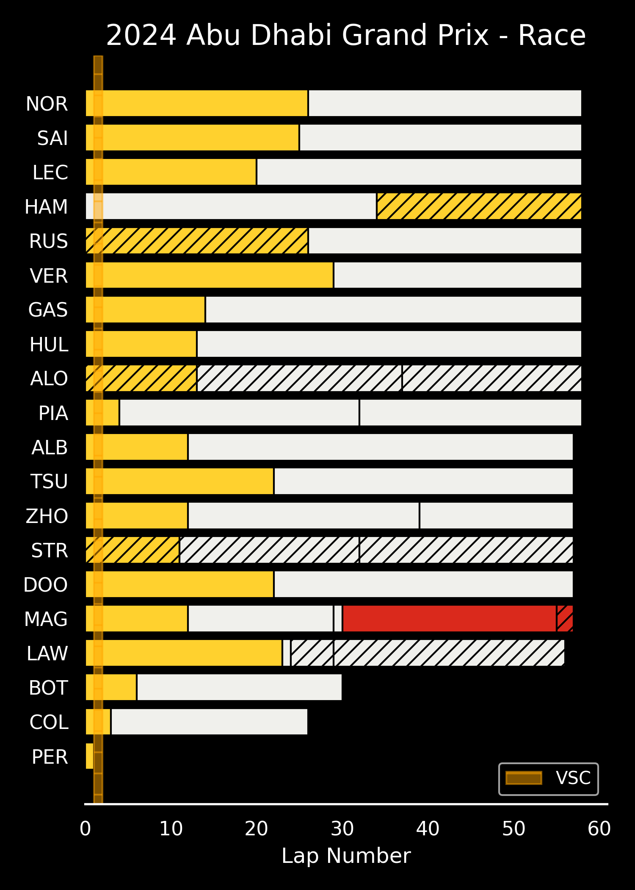
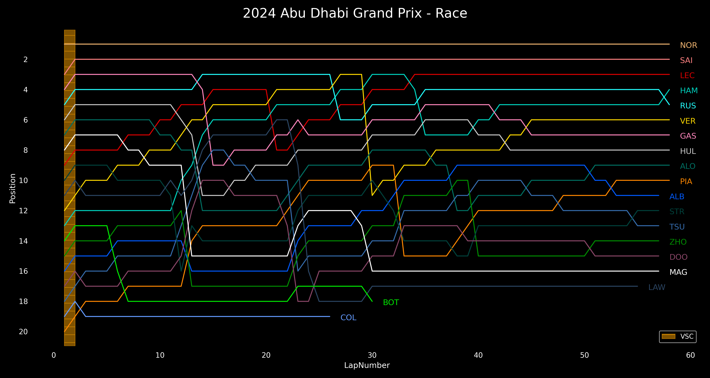
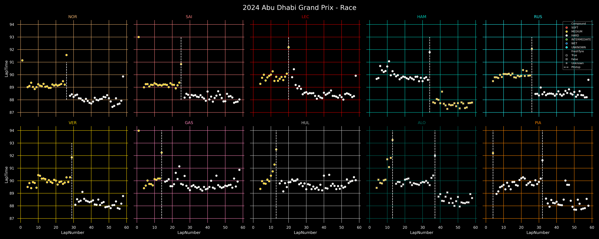
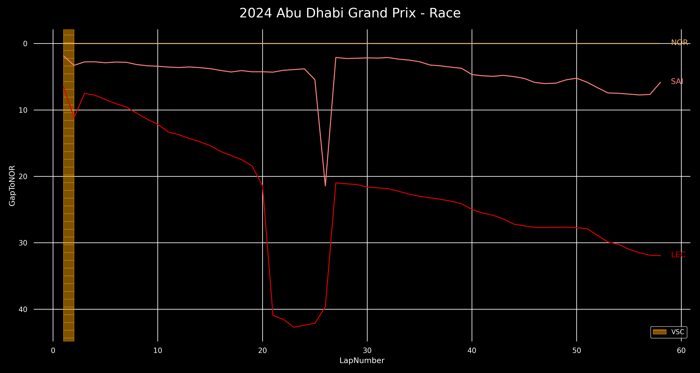
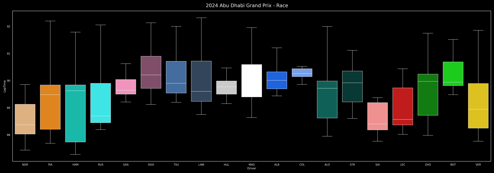
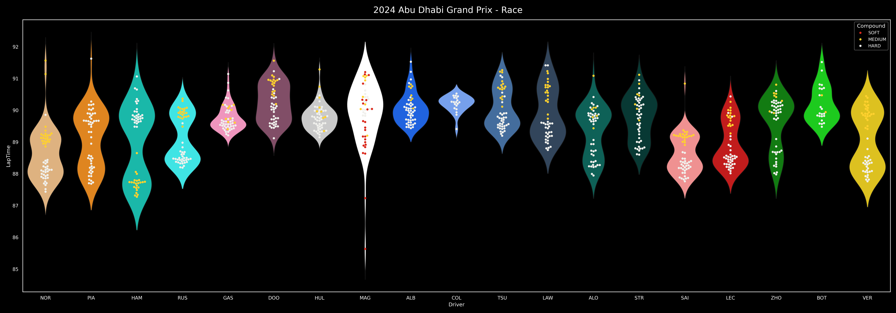
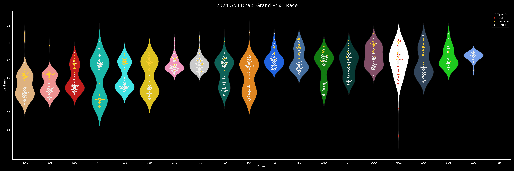
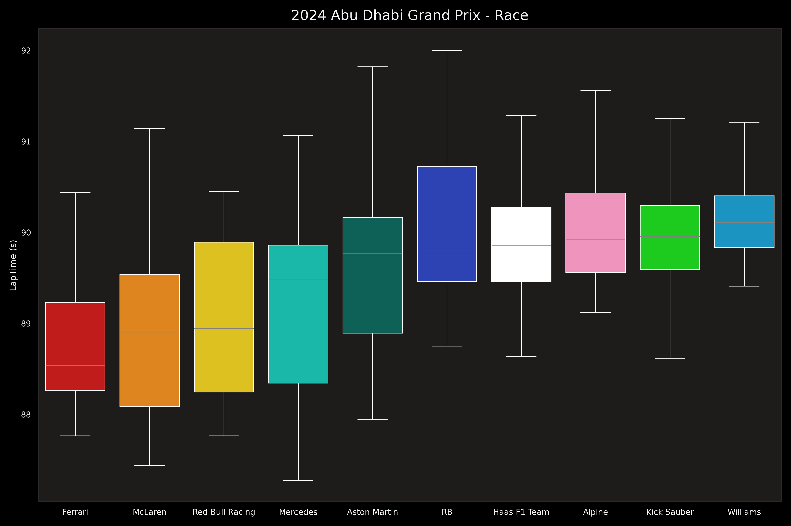

    

        <b>Pit Stop Strategies</b>
    

    
    

        

            <b>Function call:</b>
        

        <code>strategy_barplot(season, event)</code>
    

    

        <b>Position Changes</b>
    

    
    

        

            <b>Function call:</b>
        

        <code>driver_stats_scatterplot(season, event, drivers=10)</code>
    

    

        <b>Point Finishers Race Pace</b>
    

    
    

        

            <b>Function call:</b>
        

        <code>strategy_barplot(season, event)</code>
    

    

        <b>Podium Finishers Gap to Winner</b>
    

    
    

        

            <b>Function call:</b>
        

        <code>driver_stats_lineplot(season, event, drivers=3)</code>
    

    

        <b>Teammate Pace Comparisons</b>
    

    Boxplot visualization:
    
    

        

            <b>Function call:</b>
        

        <code>driver_stats_distplot(season, event, violin=False, swarm=False, teammate_comp=True)</code>
    

    Violinplot with all laptimes:
    
    

        

            <b>Function call:</b>
        

        <code>driver_stats_distplot(season, event, teammate_comp=True)</code>
    

    

        <b>Driver Pace Comparison</b>
    

    
    

        

            <b>Function call:</b>
        

        <code>driver_stats_distplot(season, event)</code>
    

    

        <b>Team Pace Ranking</b>
    

    
    

        

            <b>Function call:</b>
        

        See <code>readme_machine.py</code>
    

    

        <b>Tyre Degradation Lineplot</b>
    

    
    

        

            <b>Function call:</b>
        

        <code>compounds_lineplot(seasons, events)</code>
    

    

        <b>Tyre Degradation Distribution Plot</b>
    

    
    

        

            <b>Function call:</b>
        

        <code>compounds_distplot(seasons, events)</code>
    

